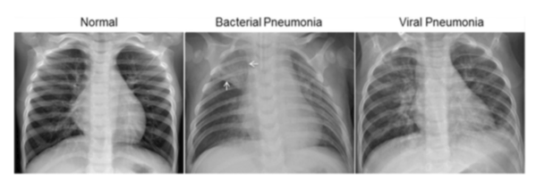

# Pneumonia Classification in Pytorch

This is a Pytorch based convolutional neural network for detecting pneumonia in frontal-view chext X-ray images.

## Dataset

The project uses data from the [Chest X-Ray Images](https://www.kaggle.com/paultimothymooney/chest-xray-pneumonia) dataset on kaggle.

There are 5,863 chest X-Ray images (JPEG) and 2 categories (Pneumonia/Normal).

## Prerequisites

- Python 3.5+
- [Pytorch](http://pytorch.org/) and its dependencies

## Usage

1. Clone this repository.

2. Download chest X-ray images from [kaggle](https://www.kaggle.com/paultimothymooney/chest-xray-pneumonia).

3. Run `model_stn.ipynb`

## Results

- Base model (resnet 34) without dropout in the fully connected layer achieves a test accuracy of 92.79%. 
  - run `model_no_dropout.ipynb`

- Model with dropout in the fully connected layers achieves a test accuracy of 95.03%.
  - run `model_dropout.ipynb`

- Model that uses a [spatial transformer network](https://arxiv.org/abs/1506.02025) before the convolutional neural network achieves a test accuracy of 95.51%.
  - run `model_stn.ipynb`

